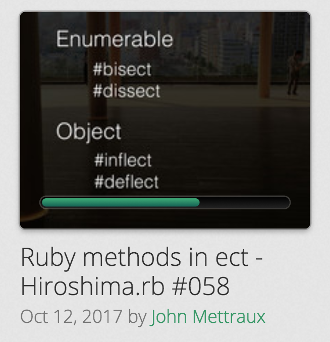

# ect

Ruby methods ending in `ect`.

The subject of last part of a [lightning talk](https://speakerdeck.com/jmettraux/ruby-methods-in-ect-hiroshima-dot-rb-number-058) for [Hiroshima.rb #058](https://hiroshimarb.connpass.com/event/65459/).

## Object

### `Object#inflect`
### `Object#deflect`

## Enumerable

### `Enumerable#bisect`
### `Enumerable#dissect`

## LICENSE

MIT, see [LICENSE.txt](LICENSE.txt)

